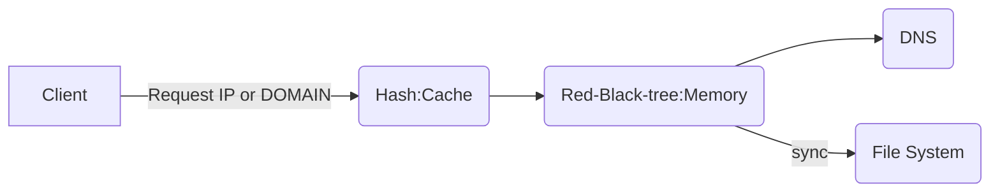

# Linux-based DNS Server Programm
- Programm Structure

- Programm Flow
	1. A client request domain or ip to cache that is in server
 	2. If the cache has that, return response
 	3. But if not, the cache request red-black-tree for domain or ip 
 	4. if the rb-tree has that, return response
 	5. But if not, the rb-tree request DNS for that
 	6. And when the requests comes 5 times, rb-tree syncronizes with the file-system. 

- Usage
	- $ [programm name] [IP or DOMAIN]
